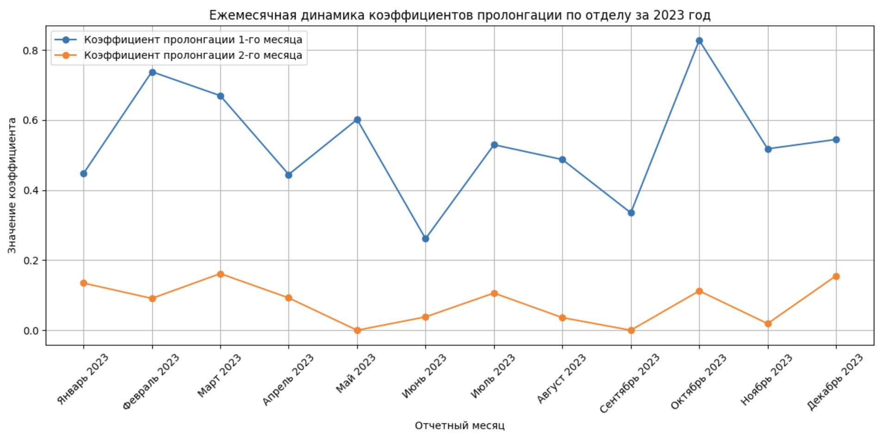
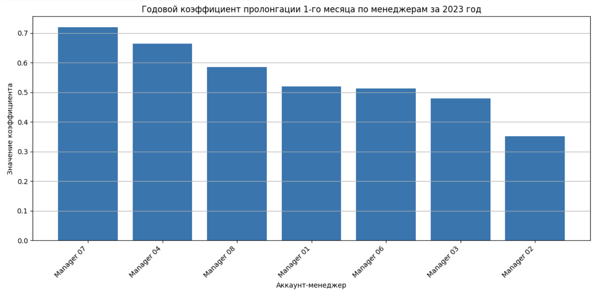
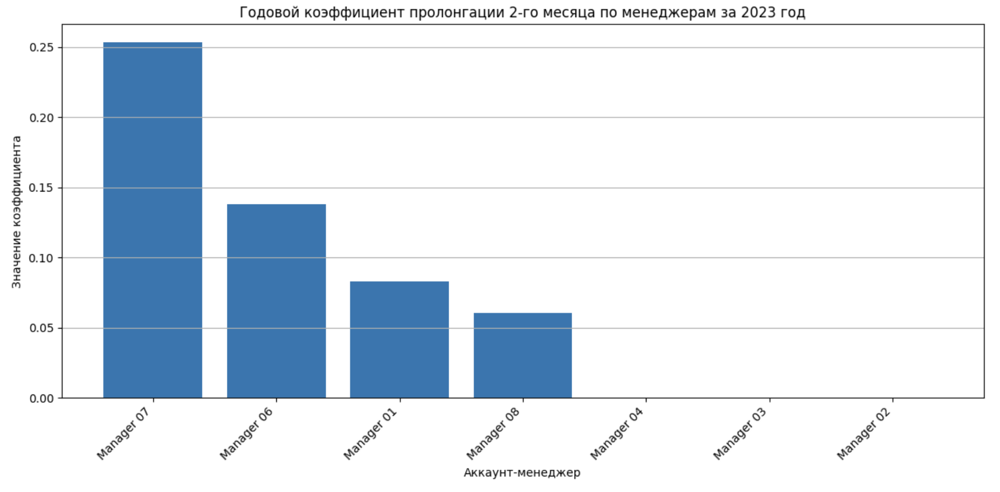

# Анализ коэффициентов пролонгации клиентов за 2023 год

## Описание проекта

Проект посвящен анализу пролонгации клиентских проектов за 2023 год.  
Цель анализа: рассчитать коэффициенты пролонгации по аккаунт-менеджерам и по отделу в целом, выявить динамику по месяцам и подготовить управленческий отчет для руководителя отдела сопровождения клиентов.

Проект выполнен как аналитический кейс с использованием Python, pandas и Google Sheets / Excel.

## Бизнес-задача

Необходимо оценить, насколько эффективно аккаунт-менеджеры справляются с пролонгацией клиентских проектов после завершения основного периода реализации.

В анализе использовались два коэффициента:

1. **Коэффициент пролонгации 1-го месяца**  
   Показывает, какая доля отгрузки была сохранена в первый месяц после завершения проекта.

2. **Коэффициент пролонгации 2-го месяца**  
   Рассчитывается только для проектов, которые не были пролонгированы в первый месяц, и показывает, какая доля отгрузки была восстановлена во второй месяц.

## Данные

В проекте использованы две обезличенные таблицы:
- `prolongations_portfolio.csv` — информация о проектах, месяце завершения и ответственном менеджере.
- `financial_data_portfolio.csv` — помесячные финансовые данные по проектам.

## Использованные инструменты

- Python
- pandas
- NumPy
- Google Colab / Jupyter Notebook
- Google Sheets / Excel
- Matplotlib

## Основные этапы анализа

1. Загрузка и первичная проверка данных.
2. Обработка пропусков и текстовых значений в финансовых столбцах.
3. Агрегация финансовых данных по id проекта из-за наличия дублей.
4. Преобразование русских названий месяцев в формат даты.
5. Объединение таблиц по id проекта.
6. Расчет коэффициентов пролонгации 1-го и 2-го месяца.
7. Агрегация результатов:
   - по отделу за каждый месяц;
   - по отделу за год;
   - по менеджерам за каждый месяц;
   - по менеджерам за год.
8. Подготовка аналитического отчета и визуализаций.
9. Техническая проверка итоговых расчетов.

## Итоговые результаты по отделу

| Показатель | Значение |
|---|---:|
| Коэффициент пролонгации 1-го месяца за 2023 год | 54.07% |
| Коэффициент пролонгации 2-го месяца за 2023 год | 7.36% |
| Количество наблюдений для коэффициента 1 | 384 |
| Количество наблюдений для коэффициента 2 | 368 |
| Пролонгировано в 1-й месяц | 161 |
| Пролонгировано во 2-й месяц | 18 |

## Ключевые выводы

- Годовой коэффициент пролонгации 1-го месяца по отделу составил 54.07%.
- Годовой коэффициент пролонгации 2-го месяца по отделу составил 7.36%.
- Самый высокий ежемесячный коэффициент пролонгации 1-го месяца был зафиксирован в октябре 2023 года.
- Самый низкий ежемесячный коэффициент пролонгации 1-го месяца был зафиксирован в июне 2023 года.
- Коэффициент 1-го месяца стабильно выше коэффициента 2-го месяца, что показывает, что основное удержание клиентов происходит сразу в первый месяц после завершения проекта.
- При сравнении менеджеров учитывался не только сам коэффициент, но и количество наблюдений, поскольку результаты на малой базе могут быть нестабильными.

## Визуализации

### Ежемесячная динамика по отделу



### Годовое сравнение менеджеров по коэффициенту 1



### Годовое сравнение менеджеров по коэффициенту 2



## Структура репозитория

```text
data/       — обезличенные исходные данные
notebooks/  — Jupyter Notebook с расчетами и пояснениями
reports/    — итоговый аналитический отчет
images/     — графики для README
